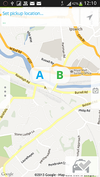
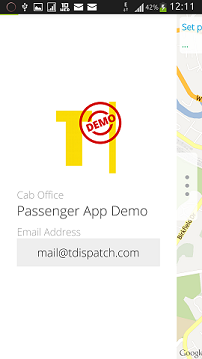
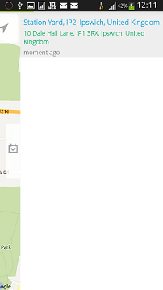
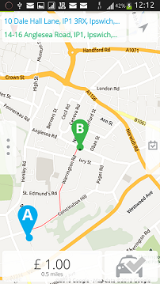
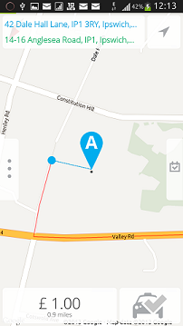
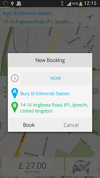
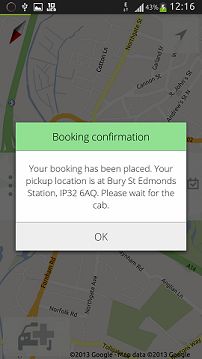
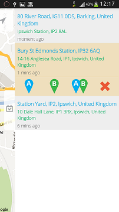
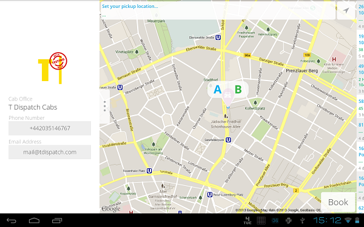
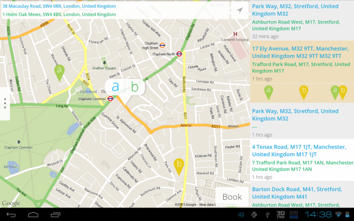

#### Copyrights

Copyright (C) 2013 T Dispatch Ltd

    T Dispatch Ltd
    35 Paul Street
    London
    UK EC2A 4UQ

For more details visit www.tdispatch.com

#### Trademarks

T Dispatch logo, T Dispatch, the T Dispatch T shaped logo are all trademarks of T Dispatch Ltd.


#### Building

Build requirements
 - At least basic knowledge on Android development
 - Eclipse
 - Android SDK + ADT
 - Google Play Services Lib

To make the app work you need to collect couple of keys and tokens for various API application is using.
Mandatory are T Dispatch APIs (Fleet API and Passenger API) and Google Maps v2 Android API.

 - Install most recent Android SDK
 - Install Google Play Services SDK: http://developer.android.com/google/play-services/setup.html
 - Import T Dispatch Passenger application sources as your Eclipse project
 - Reference Google Play Services: http://developer.android.com/tools/projects/projects-eclipse.html#ReferencingLibraryProject 

 - Rename package name (otherwise you will not be able to release the app to the Google App store), by selecting `Rename Application Package`
   in `Android Tools` context menu (press right mouse button over project root node). Choose your name wisely - you will no able to change
   it once app is released. The common pattern is to use domain name here. For example if the cab office uses `cabofficename.com` domain,
   then your pakcage name should be `com.cabofficename.passenger`.

 - Getting T Dispatch Fleet API key:
   - Log in to your T Dispatch cab office account (you need to have office manager rights)
   - Go to `Preferences` view, then `Settings` there and then `Fleet API`
   - Copy your "API key" form there and store in [common/Const.java](src/com/tdispatch/passenger/common/Const.java) as FleetApiKey
   - Contact support (@) tdispatch.com to get your ClientId and ClientSecret tokens for your app and put in
     [common/Const.java](src/com/tdispatch/passenger/common/Const.java) once you get it
   - **IMPORTANT** your application have to be **granted** access to particular cab office **before** you release the app. To do so,
     you need to access the API from your app using your Fleet API key and Client/Secret pair. The simplest approach is to just
     build the app and then click `Sign in` (you do not need toe account). That will make required API call and your app will be
     listed as one that is willing to access given cab office. Then the cab office manager has to go to his T Dispatch console,
     to `Preferences` ->  `Settings` -> `Fleet API` and click `Approve` next to your application name. From now on, you app can
     act on behalf of that cab office unless your access gets revoked manually by cab office managers.

 - To make Google Maps works you need to know SHA1 fingerprints of your certificates you will be signing your app with. We recommend
   to assign both debug and production certificate to the same API key to simplify your work and release cycle. To get SHA1 print
   of your certificate you can use `keytool` that bundled comes with Java or use any keystore management tool (standalone or Eclipse plugin)
   of your choice. The following examples use `keytool`). In you command line type:

      `keytool -list -keystore YOUR-KEYSTORE-FILE`

   After the password prompt you will be listed with all the certificates you got in the keystore. Choose the one that serves as your
   production certificate for the project and copy his SHA1 hash. If you know the alias of the certificate you can narrow the list
   to just that one certificate:

      `keytool -list -keystore YOUR-KEYSTORE-FILE -alias CERTIFICATE-ALIAS`

   Now we need to do the same with debug certificate. Location of debug keystore depends on the platform but its location can be
   easily checked by looking in Eclipse `Preferences` -> `Android` -> `Build` -> `Default debug keystore`. Once you got it located,
   you list the certificate the same way (debug keystore password is `android`):

      `keytool -list -keystore YOUR-DEBUG-KEYSTORE-FILE -alias androiddebugkey`

   Now we need to enable Google Maps API for our app. Go to Google Api Console: https://code.google.com/apis/console/
   then switch to `Services` pane, look for `Google Maps Android API v2` and enable it. Now go to `API Access` pane and create
   Google Maps Android API v2 key for your app, by clicking `Create new Android key...`. Now you need to list what apps shall
   be allowed to use this particular API key. It's done by declaring entries in form `SHA1 hash;package` (and you can enter
   as many entries as you want). So assuming your package id is `com.cabofficename.passenger`, your debug certificate hash is `DE:BB:GG:A1:12:17:F2:56:36:AD:0A:66:2B:26:A0:EE:98:94:B4:02`
   and your production certificate hash is `AA:BB:CC:DD:36:AD:0A:98:94:B4:02:66:2B:12:17:F2:56:26:A0:EE` you should enter (order is irrelevant):

    ```

      DE:BB:GG:A1:12:17:F2:56:36:AD:0A:66:2B:26:A0:EE:98:94:B4:02;com.cabofficename.passenger
      AA:BB:CC:DD:36:AD:0A:98:94:B4:02:66:2B:12:17:F2:56:26:A0:EE;com.cabofficename.passenger

    ```

   And you get your API key as the result (which looks like `AIzaTxknt93Lxj3J8ao5yhvcYjxxTjpa2bh742`) and you put it
   in [res/values/td_caboffice.xml](res/values/td_caboffice.xml) file as `caboffice_maps_api_key` entry.

 - Tweak app settings by editing [res/values/td_caboffice.xml](res/values/td_caboffice.xml) file:
    - Ensure you set own name for the app (the one that will show under the app icon on the device).
      Common pattern is to use cab office name.
    - Change application icon (`ic_launcher` asset in `drawable-*` folders).
    - Set proper default fallback location so it points to geographically correct location.
    - Disable demo warning by setting `caboffice_settings_hide_demo_warning` to `false`
    - Plant cab office logo image (`caboffice_logo` asset in `drawable-*` folders). We suggest you keep it no bigger than
      `300dp x 300dp` (density independent pixels, **NOT** raw pixels) bounds.

 - Build.


#### Translators

 - English: Marcin Orłowski
 - Deutsch (German): Adrian Doonan
 - Español (Spanish): Xavier Blanche
 - Français (French): baltmayer
 - Malay (Malay): JC Way Translation Inc.
 - Polski (Polish): Marcin Orłowski
 - Português do Brasil (Brazilian Portuguese): Mario Brandão, Bernardo Heynemann
 - Svenska (Swedish): strix
 - Українска (Ukrainian): Eugeny Perepelkov
 - русский (Russian): Eugeny Perepelkov
 - Italiano (Italian): Sonia Maccarone
 - 한국어 (Korean): JC Way Translation Inc.
 - ภาษาไทย (Thai): JC Way Translation Inc.
 - 繁體字 (Traditional Chinese): Julie Ko
 - 簡體字 (Simplified Chinese): Julie Ko
 - 日本語 (Japansese): JC Way Translation Inc.

Thank you for your contribution!


#### License

    Licensed under the GPL License, Version 3.0 (the "License");
    you may not use this file except in compliance with the License.
    You may obtain a copy of the License at

        http://www.gnu.org/licenses/gpl-3.0.html

    Unless required by applicable law or agreed to in writing, software
    distributed under the License is distributed on an "AS IS" BASIS,
    WITHOUT WARRANTIES OR CONDITIONS OF ANY KIND, either express or implied.
    See the License for the specific language governing permissions and
    limitations under the License.


#### Open Source licenses

This application uses the following third party components:

 - Sliding Menu Library by Jeremy Feinstein
 - SwipeView & PageControl by Jason Fry
 - PullToRefresh by Chris Banes
 - ViewPageIndicator by Jake Wharton
 - WebnetTools package by Marcin Orłowski


#### Screenshots Phone

 
 
 
 
 
 
 
 
 

#### Screenshots Tablets

 
 
